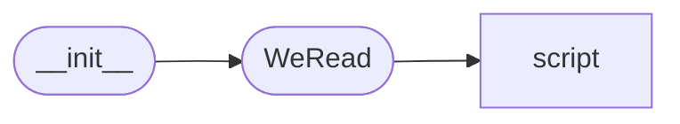

# Code Overview

[_Documentation generated by Documatic_](https://www.documatic.com)

<!---Documatic-section-Codebase Structure Python-start--->
## Codebase Structure Python

The codebase has a single-depth folder structure,
                with 5 code files in total.

<!---Documatic-block-system_architecture-start--->

<!---Documatic-block-system_architecture-end--->

# #
<!---Documatic-section-Codebase Structure Python-end--->

<!---Documatic-section-Key Objects-start--->
## Key Objects

There are exposed imports at level-0
from the source directory (WeReadScan)

<!---Documatic-block-WeReadSca-start--->

	
<code>WeReadSca</code> (Click to Expand!)

* `WeReadScan.WeRead.WeRead`

<!---Documatic-block-WeReadSca-end--->

# #
<!---Documatic-section-Key Objects-end--->

<!---Documatic-section-Important Functions-start--->
## Important Functions

<!---Documatic-block-important_funcs-start--->
<!---Documatic-block-most_used_funcs-start--->
### Most Utilised Functions

* WeReadScan.script.png2pdf.img2pdf (2 times)
* WeReadScan.script.os_util.dir_check (2 times)
* WeReadScan.script.os_util.os_start_file (2 times)
* WeReadScan.script.os_util.clear_temp (2 times)
* WeReadScan.script.png2pdf.png2bmp (1 times)
<!---Documatic-block-most_used_funcs-end--->

<!---Documatic-block-end_user_funcs-start--->
### End User Exposed Functions

* WeReadScan.WeRead.WeRead
<!---Documatic-block-end_user_funcs-end--->
<!---Documatic-block-important_funcs-end--->

# #
<!---Documatic-section-Important Functions-end--->

<!---Documatic-section-File IO-start--->
## File IO

<!---Documatic-block-file_io-start--->
The following files have file read operations

<!---Documatic-block-WeReadScan-start--->

	
<code>WeReadScan</code> (Click to Expand!)

* WeReadScan.WeRead: wrs-temp/login_qrcode.png

<!---Documatic-block-WeReadScan-end--->
<!---Documatic-block-file_io-end--->

# #
<!---Documatic-section-File IO-end--->

[_Documentation generated by Documatic_](https://www.documatic.com)